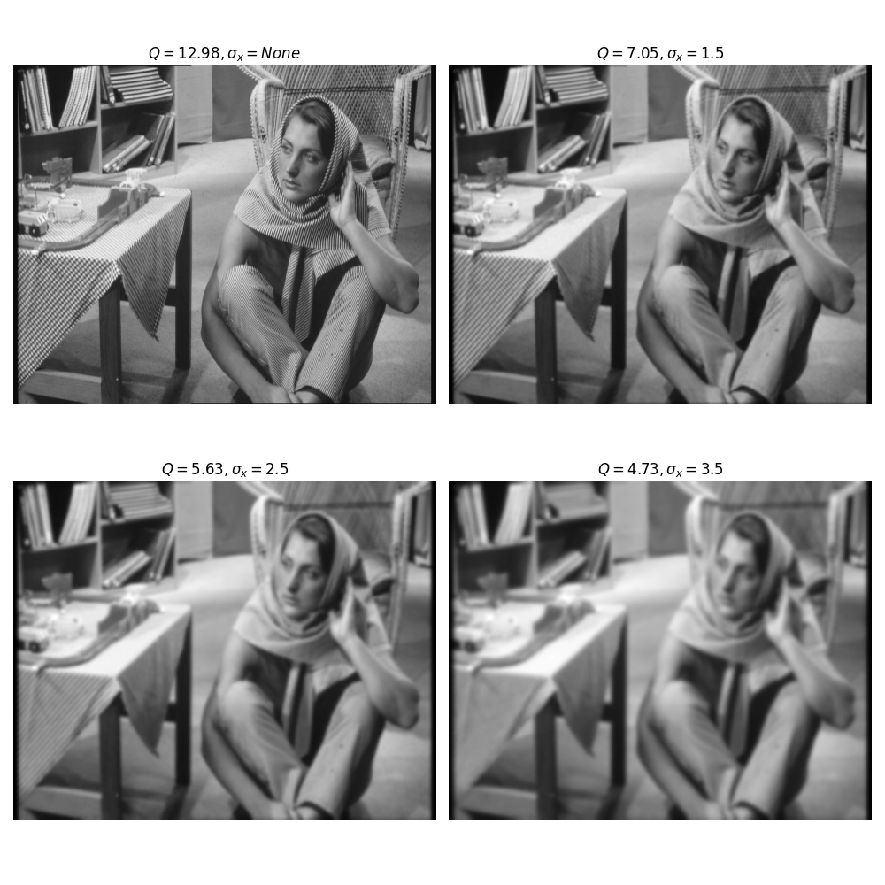

# PythonQ

Unofficial Python implementation of Metric Q proposed by Zhu and Milanfar - [https://ieeexplore.ieee.org/abstract/document/5484579], check MATLAB implementation for better understanding of nuances - [https://github.com/radiobenzene/MetricQ]

# Usage

Simply ```import pythonq``` and call ```calculate_q(img)``` this is expected to be a Numpy array with just one channel (the luma channel). Two parameters ```delta``` and ```patch_size``` are available to the user which have default values of ```0.001``` and ```8``` respectively, see Milanfar et al.'s paper for more details on the effects of changing these parameters.

> **_NOTE:_** 
> - Q can only be run for images with H, W divisible by 8
> - Q is only measured on Luma (Y) channel of the image

In addition see [example.py] for reproducing the pictures below.

## Blurring examples


## Noising examples


# Task List
- [X] Extract Luma Channel from image
- [ ] Add padding for images with non-divisible H, W
